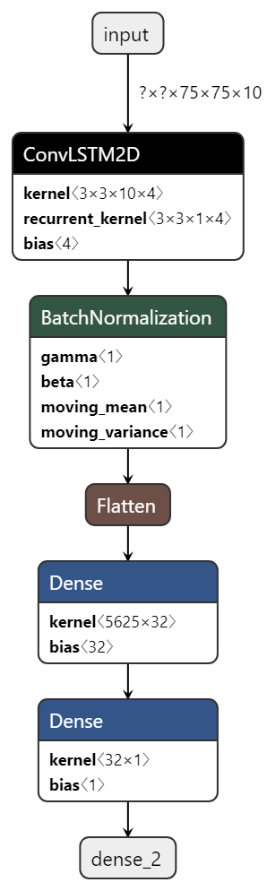
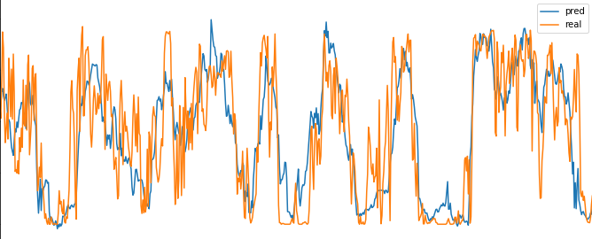
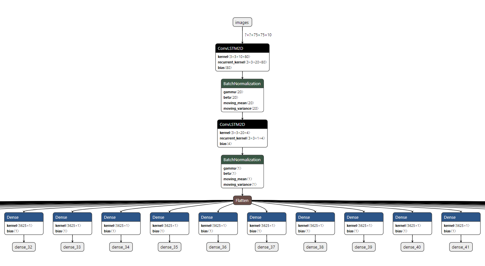

# AODC_2019
Enterprise Category - WeatherRisk &amp; GIGABYTE

- Wind power generation forecast model with django web server (prototype)  
using kma's aws, asos data

- 1 hour prediction model  

- result

> input past 72 hours weather data [temp, wind dir, wind speed ...]  
> output next 1 hour wind generation output

> input past 120 hours data  
> output next 72 hour wind generation output

for more **preprocessing** information [description](https://github.com/pnm6054/AODC_2019/blob/master/blog/static/description.html)